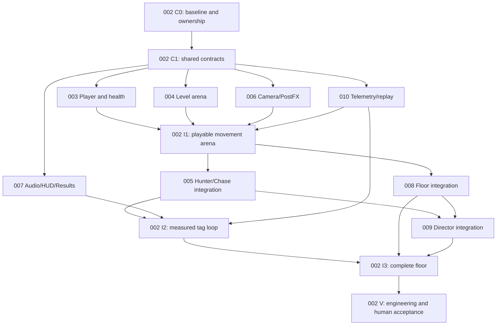

# WORSEN — Core Boilerplate Implementation Plan

> PLAN-001 · LIVE since 2026-09-14 by migration default. Implements [SPEC-001](../specs/SPEC-001-project-architecture-guidelines.md) and the solo prototype subset of [SPEC-002](../specs/SPEC-002-worsen-game-design.md). See the [registry](../index.md).
> This initialization preserves the existing plan; it does not execute milestones or verify historical implementation claims. The original sections and acceptance criteria remain below.

**Scope:** Unity, solo prototype. First-person throughout. Proves the tag loop, the detection beat and look-back, and the sweep → collapse → second-sweep floor. No procgen, no economy, no networking — but the architecture keeps networking possible.

**Definition of done:** one hand-built cluster where a chase against one hunter feels like tag, the detection beat lands on confirmed detection, the look-back reads as a skill, and a full floor plays end to end with the Director keeping pressure on throughout.

**Relationship to the architecture guidelines:** [SPEC-001 — Project architecture guidelines](../specs/SPEC-001-project-architecture-guidelines.md) is normative; this plan is a build order expressed in its vocabulary. Every script named below is one taxonomy type (Manager / Controller / BehaviorState / Config / Definitions / Driver / Presenter / DriverState / DriverConfig / Factory / Registry / Orchestrator / SceneRoot / Editor tool) in one layer (Core / Domain / Session / Presentation / Orchestrator), and every milestone closes only when the four §13 gates are green (§13e). Section references of the form §N below point at the guidelines. The gameplay values in §3 are design decisions and are unchanged from the previous revision of this plan; only structure and naming changed (see Appendix A).

---

## Parallel execution map

This plan remains the LIVE umbrella for scope and gameplay values. The physical child plans below replace the strictly serial execution order with dependency-gated workstreams; original milestone sections remain the acceptance reference. Assign exactly one worker to each owned area. The user's prior instruction to begin this plan supplies execution approval; a LIVE child still waits for its entry checkpoint and a testing lease.

M0 is implemented with [70 passing tests and live scene evidence](../../Logs/AgentValidation/M0/verification.md), with physical-device testing and documented graph-tool limitations still to address. Do not repeat M0 blindly or interpret the historical “Remaining” list below as current implementation status.

| Plan | Workstream / source coverage | Earliest independent work | Live integration waits for |
|---|---|---|---|
| [PLAN-002](PLAN-002-parallel-coordination.md) | Shared contracts, Session, routing, scene setup, testing admission and final integration | First: C0 baseline/ownership, C1 contracts | Own I1/I2/I3/V checkpoints |
| [PLAN-003](PLAN-003-player-movement-health.md) | Player movement and health; M1 + M7 rules | C1 | 004 real surfaces, 006 camera, 010 measurements |
| [PLAN-004](PLAN-004-level-tag-arena.md) | Level graph, markers, geometry and navigation; M2 | C1, parallel with Player | Coordinator shared utility/setup; 003 traversal |
| [PLAN-005](PLAN-005-hunter-chase.md) | Hunter and Chase; M3 + M4 proximity facts | C1 fixtures | 003 Player + 004 Level; 010 telemetry for acceptance |
| [PLAN-006](PLAN-006-camera-postfx-feedback.md) | Camera/PostFX; M4 visuals + M6 intrusion/M7 effects | C1 fixtures, parallel with gameplay | 003/005/009 real facts via coordinator |
| [PLAN-007](PLAN-007-audio-hud-results.md) | Audio/HUD/Results; M4 + M5/M7 presentation | C1 fixtures, parallel with gameplay | 003/005/008 and Session summaries |
| [PLAN-008](PLAN-008-floor-collapse.md) | Floor collection, collapse and room lights; M5 | C1 fixtures | 003 Player + 004 Level; Session/results integration |
| [PLAN-009](PLAN-009-director-pressure.md) | Director pacing and relief; M6 | C1 fixtures | 003/005/008 real state and 010 measurement |
| [PLAN-010](PLAN-010-telemetry-replay-tuning.md) | Telemetry, Input recording/playback and tuning; M8 brought forward | C1, alongside Player/Level | Integrates publishers progressively at I1/I2/I3 |

With four agent slots, keep a coordinator plus up to three workers active; rotate ready workstreams rather than weakening dependencies. A practical first batch is Player + Level + Telemetry, followed by presentation and Hunter as their contracts/fixtures are available. Pure fixture-backed work is not accepted as a connected feature.



The graph shows integration readiness, not a ban on earlier pure work against C1 fixtures. PLAN-002 is an ongoing coordinator plan: depend on its named checkpoint, never on its final completion.

**Shared editor rule:** every worker follows [the atomic Unity lease protocol](../../tools/coordination/README.md) before testing, Play Mode, scene setup, imports, or publishing into a checkout open in Unity. Only the token owner may proceed, and it must still verify the editor is actually idle. Other workers prepare patches outside imported paths or in isolated checkouts. Old heartbeats never permit automatic takeover.

**Architecture reconciliation:** PLAN-002's C1 boundary table controls ambiguous implementation wording below: Core-only EntityContext, a neutral traversal-surface contract, shared Core graph utility, marker→Driver→Manager→Registry lifecycle routing, and downward scene initialization. SPEC-001 remains normative. Do not copy historical names or patterns that contradict current code/policy. Gameplay values and measured/human acceptance thresholds remain unchanged.

---

## 1. Stack decisions

| Area | Decision | Why |
|---|---|---|
| Unity | Unity 6 (URP 17.x, already in `Packages/manifest.json`) | Long support window; URP is enough for a greybox prototype. |
| Input | Input System package (present). Wrapped by `PlayerInputDriver` in the Presentation layer; Domain never reads it (§9 "Input is Presentation"). | Rebinding, action maps, buffered input for the fixed tick. |
| Player movement | **Hand-rolled kinematic controller** on a fixed tick, split per §7: movement *rules* (state machine, speeds, windows) in `PlayerController` (pure C#); capsule casts and the collide-and-slide loop in `PlayerDriver`, with the slide math in `PlayerMoverPresenter` (pure C#). | The verb set (slide, rebound, momentum-preserving landings, vault) needs total control over velocity. `CharacterController` and physics-driven rigidbodies both fight you here. A pure Controller fed recorded input + probe data is also the only thing that keeps client prediction and determinism tests possible later. |
| Hunter movement | NavMesh (AI Navigation package, present) for **paths only**, queried in `HunterDriver`; steering with accel/turn-rate limits computed in `HunterSteeringPresenter`. Off-mesh links per traversal-link type. | `NavMeshAgent` steering has no inertia and will make juking meaningless. |
| Hunter decision-making | Custom GOAP (small: ~8 actions) in `HunterController` + `GoapPlannerUtility`; sensors evaluated in the Controller from probe data the Driver supplies. | Alien: Isolation model. Behavior trees deferred until an action is complex enough to need one. |
| Camera | Cinemachine 3 (**add `com.unity.cinemachine` 3.x to the manifest in M0**), wrapped entirely inside `CameraDriver` (§7a "Third-party SDKs are wrapped here"). One first-person rig on the head bone plus an impulse source for the detection punch; look-back is a yaw offset on the same rig. | Kept for impulse, noise, and settings-driven FOV, not for multi-camera blending. The rest of the project sees primitives, never a Cinemachine type. |
| Data | ScriptableObjects for all tunables, placed per §4/§4b/§7d: `PlayerProfile`, `HunterProfile` (Content SOs — archetypes carrying the prefab), `ChaseConfig`, `FloorConfig`, `DirectorConfig` (one Config per Domain system), and one `[X]DriverConfig` per Driver for visual/physical tunables (the former `FeedbackProfile`). Assets live under `Assets/Resources/ScriptableObjects/[Layer]/[System]/` (§4a). | Designers (you) tune in the Inspector at runtime. No public setters on any SO (§4). |
| Audio | Unity Audio + a tiny priority mixer (`AudioMixPresenter`, pure C#, tested) | FMOD/Wwise decision deferred; the prototype only needs presence/detection/chase/lose/death cues. |
| Tests | Unity Test Framework, EditMode, in `Assets/Editor/Tests/[System]/` (§11) | Controllers, Utilities, and Presenters are pure C# and are tested without Play Mode. `ArchitectureConformanceTests` runs alongside them. |
| Greybox | ProBuilder (optional add) or primitives | Either way the affordance language in M2 is what matters. |

---

## 2. Architecture

### 2.1 Logic / presentation split (the networking hedge)

The previous revision called this "Sim vs. View." The guidelines already define the same split with finer grain, so the plan adopts their names:

| Previous name | What it was | Guidelines equivalent |
|---|---|---|
| `PlayerSim` / `HunterSim` / `FloorSim` / `DirectorSim` | plain C# state + logic on a fixed tick | `[System]BehaviorState` (data, §3) **plus** `[System]Controller` (rules, §2). "Sim" merged two taxonomy rows, which the Quick Reference forbids ("if a script matches two rows, it is two scripts"). |
| `PlayerView` / `HunterView` / `FloorView` | MonoBehaviour that reads the sim and drives engine objects | `[System]Driver` (§7a) with `[X]Presenter` for the math and `[X]DriverState` for interpolation bookkeeping (§7b, §7c). |
| `IPhysicsQuery` called from Sim | interface so Sim could cast without Unity | Dropped. A Controller never performs a physics query, even through an interface; the Driver casts on the Manager's request and the **result** is passed in as data (§7 "A physics query a Controller needs"). See §2.6. |
| `EventBus` in Core | global message bus | Dropped. Upward communication is instance C# events on Managers, routed by Orchestrators (§6, §9). No static bus. |
| `SimClock` in Core | 60 Hz fixed tick | Dropped as a class. `Core/**` is a pure layer and may not read `Time.*`. The tick lives in `RunSessionManager.FixedUpdate` (§2.6). |
| `SeededRandom` in Core | reproducible randomness | Dropped. `System.Random` is injected via `EntityContext` (already in `Core/Definitions/`) and Manager constructors (§2). The seed lives in `RunSessionBehaviorState`. |

Rules that survive unchanged, now stated in guideline terms:
- Domain Controllers and BehaviorStates never reference `Transform`, `GameObject`, `MonoBehaviour`, or static engine APIs. `EntityId` (Core) is the only entity identity that crosses into a Controller (§1c).
- Input arrives as an `InputFrame` struct (Core/Definitions) per tick, buffered by `PlayerManager`. Controllers consume frames; they never see the Input System.
- Presentation interpolates between the last two poses (a `[X]DriverState` holds them; a Presenter computes the blend).

Later, a server owns the Domain Controllers and clients predict `PlayerController`. Nothing in the Controller changes.

### 2.2 Layers and assemblies

The five layer assemblies (§9, §12, §13a) already exist on disk and are the **only** runtime assemblies. Per-feature asmdefs (`Worsen.Player`, `Worsen.AI`, …) from the previous revision are gone; a "system" is a folder inside a layer, not an assembly.

```
Worsen.Core           Assets/Scripts/Core/           refs: nothing
Worsen.Domain         Assets/Scripts/Domain/         refs: Core
Worsen.Session        Assets/Scripts/Session/        refs: Core, Domain
Worsen.Presentation   Assets/Scripts/Presentation/   refs: Core, Unity.InputSystem
Worsen.Orchestrator   Assets/Scripts/Orchestrator/   refs: Core, Domain, Session, Presentation
Worsen.Editor         Assets/Editor/                 Editor-only; refs: all runtime asmdefs
Worsen.Tests          Assets/Editor/Tests/           Editor-only; refs: all + NUnit
```

Never add an asmdef reference to make something compile (§13a). If Domain needs something from Presentation, it publishes an event; if Presentation needs a Domain fact, an Orchestrator hands it over as primitives.

### 2.3 System map

| Layer | System folder | Kind · tier (§1b, §8) | Scripts (taxonomy type) | Replaces |
|---|---|---|---|---|
| Core | `Core/Definitions/` | — | `EntityId`, `IEntityHandle`, `EntityContext`, `SpawnRequest` (exist); `InputFrame`, `MovementProbe`, `NoiseEvent`, `HintPayload`, `LevelGraph`, `ChasePhase`, `ChaseEndReason`, `RunPhase`, `SceneKey` | `Worsen.Core` |
| Core | `Core/Utility/` | — | shared static helpers only when two systems need one | — |
| Domain | `Domain/Player/` | Entity · scene-owned | `PlayerManager` (IEntityHandle), `PlayerFactory`, `PlayerRegistry`, `PlayerController`, `PlayerBehaviorState` + `IReadOnlyPlayerState`, `PlayerProfile` (Content SO), `PlayerMoverDriverConfig`, `PlayerDefinitions`, `PlayerDriver`, `PlayerMoverPresenter`, `PlayerDriverState`, sub-driver `PlayerLimbStandIn` | `PlayerSim`, `PlayerView`, `PlayerMovementProfile` |
| Domain | `Domain/Level/` | Service · scene-owned | `LevelManager`, `LevelMarkerRegistry`, `LevelGraphUtility`, `LevelBehaviorState` + `IReadOnlyLevelState`, `LevelDefinitions` (`MarkerKind`, `CakeAnchorType`), `LevelDriver`, sub-driver `LevelMarker` | `Worsen.Level` markers, `LevelGraph` |
| Domain | `Domain/Hunter/` | Entity · scene-owned | `HunterManager` (IEntityHandle), `HunterFactory`, `HunterRegistry`, `HunterController`, `GoapPlannerUtility`, `HunterBehaviorState` + `IReadOnlyHunterState`, `HunterProfile` (Content SO), `HunterMotorDriverConfig`, `HunterDefinitions`, `HunterDriver`, `HunterSteeringPresenter`, `HunterDriverState` | `HunterSim`, `HunterSenses`, `HunterMotor`, GOAP planner |
| Domain | `Domain/Chase/` | Service · scene-owned | `ChaseManager`, `ChaseController`, `ChaseBehaviorState` + `IReadOnlyChaseState`, `ChaseConfig`, `ChaseDefinitions` | `ChaseTracker`, `ProximityDriver` closeness math |
| Domain | `Domain/Floor/` | Service · scene-owned | `FloorManager`, `FloorController`, `FloorBehaviorState` + `IReadOnlyFloorState`, `FloorConfig`, `FloorDefinitions`, `FloorDriver`, sub-drivers `CakePickup`, `RoomCollapseVolume` | `FloorSim`, `CakeSpawner`, `CollapseController`, `FloorView` |
| Domain | `Domain/Director/` | Service · scene-owned | `DirectorManager`, `DirectorController`, `DirectorBehaviorState`, `DirectorConfig`, `DirectorDefinitions` | `DirectorSim` |
| Session | `Session/Run/` | Session · persistent | `RunSessionManager` (owns the fixed tick and the run flow), `RunSessionController`, `RunSessionBehaviorState`, `RunDefinitions` | run end, `SimClock`, seed ownership |
| Session | `Session/SceneFlow/` | Session · persistent | `SceneFlowManager` (the only `SceneManager.Load*` caller, §8b) | — |
| Presentation | `Presentation/Input/` | Service · persistent | `InputManager`, `PlayerInputDriver`, sub-driver `InputRecorder`, `InputDriverConfig` | Input action map, recording/playback |
| Presentation | `Presentation/Camera/` | Service · scene-owned | `CameraManager`, `CameraDriver` (wraps Cinemachine), `CameraFeedbackPresenter`, `CameraDriverState`, `CameraDriverConfig` | `Worsen.Camera`, `ChaseFeedback`, look-back view, `DetectionSnap` |
| Presentation | `Presentation/PostFX/` | Service · scene-owned | `PostFXManager`, `PostFXDriver` (URP volume), `PostFXPresenter`, `PostFXDriverConfig` | peripheral distortion, re-acquire blur, intrusion, injury vignette |
| Presentation | `Presentation/Audio/` | Service · persistent | `AudioManager`, `AudioDriver`, `AudioMixPresenter`, `AudioDriverState`, `AudioDriverConfig` | priority mixer, cues, breath/hunter layers |
| Presentation | `Presentation/HUD/` | Service · scene-owned | `HUDManager`, `HUDDriver` (UI Toolkit), `HUDDriverConfig`; UXML/USS in `Resources/UI/Presentation/HUD/` | `Worsen.UI` |
| Presentation | `Presentation/Results/` | Service · scene-owned | `ResultsManager`, `ResultsDriver`, `ResultsDriverConfig` | results screen |
| Presentation | `Presentation/DebugOverlay/` | Service · persistent | `DebugOverlayManager`, `DebugOverlayDriver`, `DebugOverlayDriverConfig` | `Worsen.Debug` overlays |
| Presentation | `Presentation/Telemetry/` | Service · persistent | `TelemetryManager`, `TelemetryDriver` (CSV I/O), `TelemetryPresenter`, `TelemetryDriverConfig` | telemetry writer |
| Orchestrator | `Orchestrator/` | persistent | `InputOrchestrator`, `CameraOrchestrator`, `PostFXOrchestrator`, `AudioOrchestrator`, `HUDOrchestrator`, `ResultsOrchestrator`, `DebugOverlayOrchestrator`, `TelemetryOrchestrator` | ad-hoc event listeners |
| Orchestrator | `Orchestrator/Scenes/` | scene-owned | `TagArenaSceneRoot`, `FloorLoopSceneRoot` | scene wiring |
| Editor | `Assets/Editor/[System]/` | — | `TagArenaSceneSetup`, `FloorLoopSceneSetup`, `LevelMarkerDrawer`, `TuningWindow`, per-system `[System]ConfigGenerator` | tuning panel, setup |

Every Manager header declares its kind and tier; every Entity Manager implements `IEntityHandle` (§13d). The tuning panel and telemetry moved out of a `Debug` module because the guidelines have no such layer: overlays are Presentation systems, tuning is an Editor tool (§10).

### 2.4 Domain dependency order (acyclic, §2c)

Each system's header DEPENDENCIES lists exactly these. Reads are through `IReadOnly[X]State` views handed over by the SceneRoot or the Factory's `EntityContext`; writes are direct Manager calls in the declared direction.

```
Level      → Core only
Player     → Core only
Hunter     → Player (IReadOnlyPlayerState via EntityContext), Level (IReadOnlyLevelState)
Chase      → Player, Hunter (via HunterRegistry)
Floor      → Level, Player
Director   → Player, Hunter (calls HunterManager.ReceiveHint), Chase, Floor
```

- Hunter never calls Player. Lunge hits are published by `HunterManager` as `OnLungeHit(EntityId hunter, EntityId target, int damage)` and routed by `RunSessionManager` (Session → Domain direct call) to `PlayerManager.ApplyHit(...)`.
- Player noise is not an event: `PlayerController` returns `NoiseEvent`s in its tick result, `PlayerBehaviorState` keeps a short ring buffer of them, and `IReadOnlyPlayerState.RecentNoises` exposes it. Hunter senses read it. Deterministic and testable without wiring.
- `MaxDesignSpeed` (start 14 m/s) is a field on `PlayerProfile`, exposed via `IReadOnlyPlayerState`. Presentation receives `speedNormalized` (0–1) from the Orchestrator, never the constant.

### 2.5 Cross-layer routing (§6, §9)

Domain and Session publish **facts** as instance events with Core-typed payloads; Orchestrators subscribe in `OnEnable`, unsubscribe in `OnDisable`, and call Presentation Managers with primitives. Presentation publishes input/interaction/completion events the same way back. One Orchestrator per Presentation target; each one is recorded in the guidelines' §6 list when it is created. M0 already supplies InputOrchestrator and DebugOverlayOrchestrator. PLAN-002 owns later routing and lifetime integration.

| Fact (publisher) | Payload | Orchestrator → call |
|---|---|---|
| `InputManager.OnFrame` | `InputFrame` | `InputOrchestrator` → `PlayerManager.EnqueueInput(frame)` (via `PlayerRegistry`) |
| `PlayerManager.OnMovementStateChanged`, `OnLookBackChanged`, `OnSpeedSampled` | `MovementState`, `bool`, `float` | `CameraOrchestrator` → `CameraManager.SetMovementState/SetLookBack/SetSpeedNormalized`; `AudioOrchestrator` → footstep layer; `DebugOverlayOrchestrator` |
| `ChaseManager.OnChaseStarted` / `OnChaseLost` / `OnProximityChanged` | `EntityId`, —, `float closeness` | `CameraOrchestrator` → `PlayDetectionKick()`; `AudioOrchestrator` → `PlayCue(CueId.ChaseSting)`, `SetBreathGain`; `PostFXOrchestrator` → `SetPeripheralDistortion`; `HUDOrchestrator` → `SetChaseMode(bool)` |
| `PlayerManager.OnHealthChanged` / `OnDied` | `EntityId, int, int` / `EntityId, Vector3 killerPos` | `PostFXOrchestrator` → vignette; `CameraOrchestrator` → `PlayDeathSnap(Vector3)` |
| `FloorManager.OnCakeCollected`, `OnExitStateChanged`, `OnRoomPhaseChanged`, `OnDirectionCue` | `int count`, `ExitState`, `int room, RoomPhase`, `Vector3 dir` | `HUDOrchestrator`, `AudioOrchestrator` |
| `DirectorManager.OnIntrusion` | `float seconds` | `PostFXOrchestrator` → `PlayIntrusion(seconds)` |
| `RunSessionManager.OnPhaseChanged` | `RunPhase` | `HUDOrchestrator`, `ResultsOrchestrator` → `ResultsManager.Show(RunSummary)` |
| everything above | — | `TelemetryOrchestrator` → `TelemetryManager.Record(...)` |

### 2.6 Fixed tick and the physics round trip

- Project setting: Fixed Timestep = 1/60. `RunSessionManager.FixedUpdate` is the single tick owner. It calls, in this order, `PlayerManager.Tick(dt)` (each registered player), `HunterManager.Tick(dt)` (each registered hunter), `ChaseManager.Tick(dt)`, `FloorManager.Tick(dt)`, `DirectorManager.Tick(dt)`. `dt` is passed down; no Controller reads `Time.*` (§2). Fixed order from one owner replaces `[DefaultExecutionOrder]` (§8) and is what a server loop will later call.
- Inside a Domain Manager, one tick is: **probe → decide → apply → publish.**
  1. Manager asks its Driver for this tick's probe (`PlayerDriver.Probe()` runs the capsule casts: grounded, ground normal, wall distance/normal/angle, vault candidate height/clearance, marker kind of the hit collider). The Driver returns a `MovementProbe` (Core DTO).
  2. Manager calls `Controller.Tick(frame, probe, dt)`. The Controller mutates its BehaviorState and returns a result struct (desired displacement, movement state, noise events, spawn requests).
  3. Manager commands the Driver (`PlayerDriver.Move(displacement)`): the Driver runs the collide-and-slide loop (`Physics.CapsuleCast` iterations), using `PlayerMoverPresenter` for the pure slide/projection math, applies the resolved pose, and reports the resolved position and contact flags back. Manager writes them into the BehaviorState through the Controller (`Controller.CommitPose(...)`).
  4. Manager publishes state-change events.
- Determinism smoke test: `InputRecorder` records `InputFrame`s and the Manager logs each tick's `MovementProbe`; `PlayerControllerTests` replays both and asserts identical state trajectories with no scene loaded.

### 2.7 Folder layout (canonical, §12)

```
Assets/
  Scripts/
    Core/Definitions/, Core/Utility/
    Domain/{Player,Level,Hunter,Chase,Floor,Director}/
        Manager/ Controller/ State/ Config/ Definitions/ Driver/     (only the folders each system uses)
    Session/{Run,SceneFlow}/
    Presentation/{Input,Camera,PostFX,Audio,HUD,Results,DebugOverlay,Telemetry}/
        Manager/ Config/ Definitions/ Driver/                        (no Controller/ or State/, §7f)
    Orchestrator/*.cs, Orchestrator/Scenes/*.cs
  Editor/{Level,Tuning,Scenes,...}/, Editor/Shared/, Editor/Tests/{Architecture,Player,Hunter,...}/
  Resources/
    ScriptableObjects/Domain/Player/PlayerProfile.asset, ...        (mirrors Scripts/, §4a)
    UI/Presentation/HUD/*.uxml, *.uss                               (mirrors Scripts/, §10)
  Scenes/TagArena.unity (M2 greybox cluster), Scenes/FloorLoop.unity (M5+ full floor)
  Prefabs/, Greybox/, Audio/                                        (non-script assets; not governed by §12)
```

No `_Project/` prefix (the conformance tests walk `Assets/Scripts` and `Assets/Editor`), no `Data/` folder (SO assets go in the `Resources/ScriptableObjects/` mirror), no empty "for later" folders (§12), no `.asset` under `Scripts/` (§4a). Namespaces mirror the path: `Worsen.Domain.Player`, `Worsen.Presentation.Camera`, `Worsen.Orchestrator`.

---

## 3. Milestones (build order, each gates the next)

Every milestone ends with the §13e definition of done: headers on every touched file (§0), tests for every touched Controller/Utility/Presenter (§11), `ast-grep scan` clean, GitNexus impact reviewed and index refreshed, `ArchitectureConformanceTests` green.

### M0 — Skeleton (≈ 2–3 days)
Already in place as of 2026-09-14: the five layer asmdefs plus `Worsen.Editor` and `Worsen.Tests`; `Core/Definitions/{EntityId, IEntityHandle, EntityContext, SpawnRequest}`; `ArchitectureConformanceTests`; the ast-grep rule set and pre-commit hook; the GitNexus conformance queries. Remaining:
- Packages: add Cinemachine 3.x (and ProBuilder if used). Set Fixed Timestep to 1/60.
- `Core/Definitions/`: `InputFrame` (move axis, look delta, button edges, look-back held), `MovementProbe`, `NoiseEvent`, `RunPhase`, `SceneKey`.
- `Presentation/Input/`: `InputManager` (Service, persistent), `PlayerInputDriver` wrapping the action map (Move, Look, Sprint, Jump, Crouch, LookBack, Interact, UseItem), accumulating into one `InputFrame` per publish; `InputDriverConfig`.
- `Session/Run/`: `RunSessionManager` (tick owner, seed owner), `RunSessionController` (`RunPhase Next(RunPhase, RunEvent)`), `RunSessionBehaviorState`, `RunDefinitions`. `Session/SceneFlow/`: `SceneFlowManager`, minimal.
- `Orchestrator/`: `InputOrchestrator`, `DebugOverlayOrchestrator`; `Orchestrator/Scenes/TagArenaSceneRoot` (wires serialized references, publishes `SceneReady`).
- `Presentation/DebugOverlay/`: speed, state name, tick (UI Toolkit; UXML under `Resources/UI/Presentation/DebugOverlay/`).
- `Assets/Editor/Scenes/TagArenaSceneSetup.cs` under `Worsen/Scenes/1 — Build TagArena` — the first Setup tool, to be named as the §10 reference implementation.
- Record `InputOrchestrator` and `DebugOverlayOrchestrator` in the guidelines' §6 list and `RunSessionManager`'s lifecycle in §8.

### M1 — Movement controller (≈ 1.5–2 weeks)
**Deliverable:** chain sprint → slide → slide-jump → vault → wall rebound → land into sprint without a hitch, in an empty test room.

System: `Domain/Player/` (Entity). `PlayerFactory.Spawn` instantiates the prefab named by `PlayerProfile`, mints an `EntityId`, calls `PlayerManager.Initialize(profile, ctx)`, registers in `PlayerRegistry`.

States (in `PlayerDefinitions.MovementState`, transitions in `PlayerController`): `Ground`, `Air`, `Slide`, `Vault`, `Stumble`. Keep it a flat state machine; no sub-states yet.

Key mechanics and starting values (all serialized on `PlayerProfile`, read by `PlayerController`; capsule dimensions, skin width, cast iteration cap, and the 50% slide capsule height are physical and live on `PlayerMoverDriverConfig`):
- Sprint is default ground speed. **Start: 8.0 m/s.** Walk exists only for precision (hold, 4.0 m/s).
- Ground accel 60 m/s², ground friction high so direction changes are near-instant (this is the player's edge over the hunter).
- Jump: buffer 0.1 s, coyote 0.1 s, initial vertical 5.5 m/s, air steering accel 25 m/s² capped at current horizontal speed (no free acceleration in air).
- Slide: entry requires ≥ 6 m/s; initial boost +2 m/s; friction curve decays to sprint over ~1.2 s; slide-jump preserves horizontal velocity. Slide capsule height 50%.
- Vault: `MovementProbe.VaultCandidate` is set when the Driver's forward capsule cast hits a `LevelMarker` of kind `VaultSurface` at waist height with clearance above; the Controller applies the 0.25 s lock and preserves entry speed. Mantle is the same with a higher ledge and 0.35 s lock.
- Wall rebound: on `Air`, probe reports a wall within 0.6 m at ≤ 45° to facing; jump input within 0.15 s window → velocity reflected plus 3 m/s upward; 0.4 s cooldown; no chaining off the same wall (the probe carries a wall id).
- Landing: if vertical impact < 12 m/s keep 100% horizontal; 12–18 m/s keep 60% and play 0.2 s soft stumble; > 18 m/s `Stumble` 0.5 s, keep 30%. Never a hard reset.
- Look-back (rules side): while `InputFrame.lookBack` is held, `PlayerBehaviorState.LookBack = true`. Move input is decomposed against the current heading: the forward component passes through, the lateral component is scaled by `lookBackSteerAuthority` (**start: 0.35**). Jump, slide, vault, and rebound stay available (a blind vault is the player's risk to take). Look delta while held rotates the head, not the body heading; body heading resumes from look delta on release. Head yaw itself is presentation (M4).
- `MaxDesignSpeed` (**start: 14 m/s**) on `PlayerProfile` clamps everything; every later Domain system reads it via `IReadOnlyPlayerState`.

Driver side: `PlayerDriver.Probe()` and `Move(displacement)` per §2.6; `PlayerMoverPresenter` (collide-and-slide projection, step/ground snapping, interpolation between the two poses in `PlayerDriverState`) is the project's first Presenter and is named as the §7b reference implementation once written. `PlayerLimbStandIn` (sub-driver) shows capsule hands/feet at the frame edge on vault and slide.

Tests: `Assets/Editor/Tests/Player/PlayerControllerTests.cs`, `PlayerMoverPresenterTests.cs`.

Acceptance:
- Telemetry shows 90th-percentile horizontal speed in free movement ≥ 9 m/s.
- No verb transition exceeds a 0.35 s input lock.
- Controller runs identically from a recorded `InputFrame` + `MovementProbe` sequence (determinism smoke test, no scene).

### M2 — Tag arena (≈ 1 week, overlaps M1)
**Deliverable:** one greybox cluster built to the GDD's cluster rules.

System: `Domain/Level/` (Service, scene-owned). `LevelMarker` is a sub-driver (`MonoBehaviour` + `MarkerKind` enum) that registers itself in `LevelMarkerRegistry` on `OnEnable`/`OnDisable` (§8 Registry pattern). On `SceneReady`, `LevelManager` bakes the registrants into a `LevelGraph` (Core DTO, since Floor, Hunter, and Director all read it) using `LevelGraphUtility` (pure: rooms, edges, room distances) and exposes it through `IReadOnlyLevelState`.

- Three height classes represented: a low connector, a mid braided room with ≥ 2 exits and a micro-loop, a tall atrium with a vertical line and a one-way drop back to the mid room.
- One long diagonal sightline through the mid room.
- Marker kinds: `VaultSurface`, `SlideGate`, `ReboundSurface`, `OneWayDrop`, `LosBreak`, `CakeAnchor{Flow,Precision,Detour,Risk,Vertical}`, `HunterLink`, `ExitMarker`.
- NavMesh baked; `NavMeshLink`s placed on `HunterLink` markers by `TagArenaSceneSetup` (editor tool; rebuildable, §10).
- A "hunter-only" straight corridor and a "player-only" cluttered route, so the speed-ratio rule is testable.
- Affordance language on the greybox, Mirror's Edge convention: vault surfaces at one consistent waist height with a lit top edge, rebound surfaces with a distinct stripe material, slide gates with a hard silhouette, one-way drops with a lip. These must read at 8–14 m/s in first-person; if a tester hesitates before a vault, the surface is wrong.

Editor: `Assets/Editor/Level/LevelMarkerDrawer.cs` (kind-colored gizmos). Tests: `Assets/Editor/Tests/Level/LevelGraphUtilityTests.cs`.

### M3 — Hunter v1 (≈ 2–3 weeks)
**Deliverable:** a chase in the tag arena that a tester describes as "tag," not "a timer."

System: `Domain/Hunter/` (Entity). `HunterFactory` spawns from `HunterProfile`; `EntityContext` carries `IReadOnlyPlayerState` and `IReadOnlyLevelState` (extend the struct per its header note).

`HunterProfile` (Content SO, §4b — one asset per hunter archetype, carries the prefab) — the four tunables, starting values:
| Tunable | Fields | Start |
|---|---|---|
| Inertia | `accel`, `turnRateDegPerSec` | 20 m/s², 240°/s |
| Commitment | `lungeWindup`, `lungeActive`, `lungeRecovery`, `lungeDistance`, `lungeSpeed` | 0.25 s, 0.30 s, 0.80 s, 4 m, 18 m/s |
| Speed ratio | `chaseSpeed` (as multiple of player sprint) | 1.12 |
| Loss rule | `losBreakSeconds`, `losBreakDistance` | 2.5 s, 14 m |

Also: `sightConeDeg` 110, `sightRange` 30 m, `hearingRange` 18 m, `memoryDecaySeconds` 8.

Sensors (evaluated in `HunterController` every 4 ticks from data pushed in):
- Sight: `HunterDriver.ProbeSight(headPos, chestPos, hipsPos)` raycasts the three points and returns a `SightProbe` (any hit = visible); the cone/range test is pure and lives in the Controller.
- Hearing: `IReadOnlyPlayerState.RecentNoises` (sprint footsteps low, slide mid, vault/rebound/land high). Hunter hears if `loudness * falloff(dist) > threshold`.
- Belief (in `HunterBehaviorState`): `lastKnownPos`, `lastKnownTick`, `confidence` (decays). Director hints arrive via `HunterManager.ReceiveHint(HintPayload)` and write into belief with a supplied age and radius.

GOAP (`HunterController` + `GoapPlannerUtility`):
- World state keys: `PlayerVisible`, `PlayerHeard`, `HasBelief`, `BeliefFresh`, `InLungeRange`, `LoopDetected`, `HasHint`.
- Goals (priority): `CatchPlayer` > `FindPlayer` > `Patrol`.
- Actions with preconditions/effects/cost: `Patrol`, `InvestigateHint`, `Stalk` (approach without breaking cover — optional for v1), `Chase`, `Lunge`, `SearchLastKnown`, `CutOff` (path to a predicted intercept node from `LevelGraph` instead of the player), `BreakLoop` (v2).
- Planner: A* over actions in `GoapPlannerUtility`; replan when a world-state key flips or the current action fails. Keep the planner under 100 lines; it is not the hard part.

Steering (Driver side): `HunterDriver` queries `NavMesh.CalculatePath` to the Controller's target and stores the corners in `HunterDriverState`; `HunterSteeringPresenter` turns corners + (`accel`, `turnRate`, `chaseSpeed`, passed as primitives) into a pose step (`Vector3.RotateTowards` at `turnRate` → accelerate at `accel`). Lunge: the Controller owns the phase machine (windup / active / recovery) and the decision; the Presenter computes the dash motion; the Driver runs the capsule-overlap check during active frames and publishes `OnLungeContact(Collider)`; `HunterManager` resolves it to an `EntityId` and publishes `OnLungeHit`. Recovery speed 0 — a miss is visibly costly.

Chase state: `Domain/Chase/` (Service, scene-owned), owned outside the hunter as before. `ChaseController` (reads `IReadOnlyPlayerState` and each `IReadOnlyHunterState`): `None → Confirmed` when a hunter has continuous sight for 0.3 s; `Confirmed → Lost` when `losBreakSeconds` elapsed with no sight AND distance > `losBreakDistance`; `Lost → None` after a 1.5 s grace. It also computes `closeness` (M4) so Presentation receives one primitive. `ChaseManager` publishes `OnChaseStarted`, `OnChaseLost`, `OnProximityChanged`; the detection beat, proximity effect, and audio are routed by Orchestrators (§2.5).

Tests: `Assets/Editor/Tests/Hunter/{HunterControllerTests, GoapPlannerUtilityTests, HunterSteeringPresenterTests}.cs`, `Assets/Editor/Tests/Chase/ChaseControllerTests.cs`.

Acceptance (measured via M8 telemetry over ≥ 30 chases):
- Median chase length 12–25 s.
- ≥ 40% of chases end by loss, not catch (otherwise the hunter is a timer).
- ≥ 60% of catches are lunges, not "cornered while running" (otherwise geometry is doing all the work).
- Player can consistently gain ground with a hard cut in the mid room and consistently lose ground in the straight corridor.

### M4 — Detection beat, look-back, first-person readability (≈ 1 week)
All values live on the owning Driver's `[X]DriverConfig` (§7d) so they are tunable at runtime: `CameraDriverConfig`, `PostFXDriverConfig`, `AudioDriverConfig`, `HUDDriverConfig`. These four replace the previous single `FeedbackProfile`; one SO per Driver is the rule, sharing is the exception.

- **Detection beat** (`CameraOrchestrator`/`AudioOrchestrator`/`HUDOrchestrator` on `OnChaseStarted`): `CameraFeedbackPresenter` FOV kick +12° over 0.08 s decaying over 0.4 s; `CameraDriver` fires the Cinemachine impulse; `AudioMixPresenter` plays the chase sting through the priority mixer; `HUDManager.SetChaseMode(true)` drops the HUD to counter + exit state only. On `OnChaseLost`: lose cue, HUD restores over 0.5 s.
- **Proximity effect** (`ChaseController` ticks during `Confirmed`/`Lost`): `closeness` in 0–1 from hunter distance mapped over (4 m → 1.0, 20 m → 0.0), weighted ×1.0 if the hunter is in the rear hemisphere and ×0.5 if in front (you can see it in front). Published as `OnProximityChanged(float)`. `PostFXPresenter` maps it to peripheral distortion strength, `AudioMixPresenter` to breath layer gain and the hunter's own sound-layer gain. This is how distance is readable without being shown.
- **Look-back presentation** (`CameraManager.SetLookBack(bool)` from `PlayerManager.OnLookBackChanged`): `CameraFeedbackPresenter` eases head yaw to 160° over 0.12 s with pitch clamped to ±20°; on release, returns over 0.15 s with a 0.1 s re-acquire blur (`PostFXManager`, toggleable). Body/heading logic is already in M1; this is view only.
- **First-person readability**: base horizontal FOV 95°, +8° at `speedNormalized = 1` (i.e. `MaxDesignSpeed`); roll ±6° on slide, ±10° on rebound (`CameraManager.SetMovementState`); `PlayerLimbStandIn` hands/feet at the frame edge on vault and slide. Settings: FOV, tilt on/off, punch intensity, re-acquire blur on/off — as `CameraDriverConfig`/`PostFXDriverConfig` fields for the prototype; a persisted user-settings Session is deferred.
- **Optional hypothesis, behind a `CameraDriverConfig` toggle, built last**: `CameraManager.PlayDetectionSnap()`, a 0.5 s third-person pull-out on `OnChaseStarted` that returns to first-person before the hunter closes. Tested only after the first-person beat has been through a full M3 chase set.

Tests: `Assets/Editor/Tests/Camera/CameraFeedbackPresenterTests.cs`, `Assets/Editor/Tests/PostFX/PostFXPresenterTests.cs`, `Assets/Editor/Tests/Audio/AudioMixPresenterTests.cs`. Record `CameraOrchestrator`, `PostFXOrchestrator`, `AudioOrchestrator`, `HUDOrchestrator` in the guidelines' §6 list.

Acceptance:
- In a blind probe (screen covered for 1 s during a chase), testers name the hunter's distance band (near / mid / far) from audio + proximity effect ≥ 70% of the time.
- Look-back is used ≥ 1× per chase on average, and the vault-failure rate during chases does not exceed the free-movement rate by more than 10 points.
- No motion-sickness reports at default settings across 15-minute sessions (small sample; log it anyway).

### M5 — Floor loop (≈ 2 weeks)
System: `Domain/Floor/` (Service, scene-owned) plus `Session/Run/` for the run flow and `Presentation/Results/`.

- `FloorController`: picks cake anchors from `IReadOnlyLevelState` by type weights using the injected `System.Random`; `FloorDriver` instantiates `CakePickup` sub-drivers at them (trigger volumes). `CakePickup` publishes the entering `Collider`; `FloorManager` resolves it to an `EntityId` and the Controller applies `Collected` → shared counter in `FloorBehaviorState`; `ExitState {Locked, Open}`.
- Direction cue: `FloorDriver.PathLength(from, to)` (NavMesh path distance, not Euclidean) for each uncollected cake, evaluated every 0.5 s; `FloorManager` publishes `OnDirectionCue(Vector3)`; `HUDOrchestrator` → HUD arrow.
- Collapse: at `SceneReady`, `FloorController` computes each room's topological distance from the exit (`LevelGraphUtility` BFS over `LevelGraph`). On exit open, it schedules rooms farthest-first with a fixed interval (`FloorConfig`); each room enters `Telegraph` (T = 6 s) then `Closed`. `FloorManager` publishes `OnRoomPhaseChanged(room, phase)` (audio + light change routed by Orchestrators) and commands `FloorDriver.CloseRoom(room)`: NavMesh area cost → impassable for hunters, `RoomCollapseVolume` sub-driver raises door blockers and arms a lethal volume. Exit cue replaces cake cue.
- Golden Cakes spawn on the same anchors on exit open; wallet in `FloorBehaviorState` increments; leave-or-stay is just "walk into the exit."
- Run end: `RunSessionController` phases `Boot → FirstSweep → ExitOpen → Collapse → Ended(reason)`; on solo death (`PlayerManager.OnDied`, or `RoomCollapseVolume` contact resolved and routed by `RunSessionManager`) or exit, `RunSessionManager` publishes `OnPhaseChanged(Ended)` with a `RunSummary` (time, cakes, golden cakes, chase stats); `ResultsOrchestrator` → `ResultsManager.Show(summary)`; restart goes through `SceneFlowManager`.

Tests: `Assets/Editor/Tests/Floor/FloorControllerTests.cs`, `Assets/Editor/Tests/Run/RunSessionControllerTests.cs`. Add `FloorLoopSceneRoot` and `FloorLoopSceneSetup`.

Acceptance: a full floor plays in 2–4 minutes for the first sweep without the player ever stopping for an interaction.

### M6 — Director v1 (≈ 1.5 weeks)
System: `Domain/Director/` (Service, scene-owned). Ticked by `RunSessionManager` every fixed tick; `DirectorController` accumulates `dt` and evaluates at 2 Hz.
- Per player (in `DirectorBehaviorState`): `heat` (time since last chase or hunter proximity), `relief` (time since chase ended), and a ring buffer of sampled player positions so "position as of N seconds ago" is available without querying anyone.
- Pace guarantee: if `heat > heatThreshold` (start 20 s), the Controller returns a `HintPayload` (Core DTO: position **as of `hintAge` seconds ago** (start 3 s), `hintRadius` (start 8 m), age) for the assigned hunter; `DirectorManager` calls `HunterManager.ReceiveHint(...)` through `HunterRegistry`. Hunter belief updates; GOAP picks `InvestigateHint`.
- Relief spacing: no hint while `relief < reliefMin` (start 10 s).
- Hint cadence scales with floor state (`IReadOnlyFloorState.ExitState`): tighter after exit opens.
- One systemic threat as proof of the "regular enemy" category: when the player has been stationary or slow for > 3 s the Controller returns an intrusion result; `DirectorManager.OnIntrusion(2 s)` → `PostFXOrchestrator` → desaturate + static for 2 s (reinforces "nothing stops the run").

Tests: `Assets/Editor/Tests/Director/DirectorControllerTests.cs`.

Acceptance: over a floor, the max gap between hunter proximity events (< 20 m) never exceeds `heatThreshold + hintAge + travel time`; testers report no "wandering" stretches.

### M7 — Health, injury, HUD (≈ 1 week)
- Hidden `health` (start 100) in `PlayerBehaviorState`; `PlayerController.ApplyHit` rules: lunge hit = 50; states at 100 / 50 / 25 / 0; injured state reduces max speed by 5% (readable, not crippling); `PlayerManager` publishes `OnHealthChanged(EntityId, current, max)` → `PostFXOrchestrator` adds vignette + `AudioOrchestrator` breathing at critical.
- Death: `PlayerManager.OnDied(EntityId, Vector3 killerPos)` → `RunSessionManager` locks input (`InputOrchestrator` gate) and ends the run; `CameraOrchestrator` → `CameraManager.PlayDeathSnap(killerPos)` (jumpscare snap to the hunter); results as in M5.
- HUD (`HUDManager` commands: `SetCount`, `SetExitState`, `SetItemSlots` (empty for now)); injury vignette lives in PostFX.

### M8 — Tuning harness (built alongside M3, finished here)
- **Tuning**: the Inspector on the SO assets under `Resources/ScriptableObjects/` (runtime edits in the Editor persist, which is the workflow wanted), plus `Assets/Editor/Tuning/TuningWindow.cs` (`Worsen/Tuning/Open Tuning Window`) that gathers every Config/Profile/DriverConfig into one `SerializedObject`-backed panel. There is **no runtime IMGUI panel** writing SO fields — §4 forbids public setters on SOs and a runtime write mutates a shared asset.
- **Telemetry** (`Presentation/Telemetry/`): `TelemetryOrchestrator` subscribes to Chase/Player/Director/Floor/Run events; `TelemetryPresenter` (pure, tested) aggregates rows; `TelemetryDriver` writes one CSV per session under `Application.persistentDataPath`. Rows: per-chase length, end reason (`ChaseEndReason.{Lunge, Cornered, Lost}`, Core), per-tick player speed, look-back events (start tick, duration, whether a catch occurred within 1 s of release), vault attempts and failures tagged in-chase vs free, heat gaps, floor time.
- **Seeded runs**: the seed lives in `RunSessionBehaviorState`; `RunSessionManager` builds one `System.Random` and hands it to `PlayerFactory`/`HunterFactory` (→ `EntityContext.Random`) and to `FloorManager`/`DirectorManager`. A seed reproduces cake placement and Director timing so a chase can be re-run after a tuning change.
- **Input recording/playback**: `InputRecorder` (sub-driver owned by `PlayerInputDriver`) records/plays `InputFrame` streams; `InputManager.SetSource(Live | Playback)`. Combined with the M1 probe log this drives the determinism smoke test.

Tests: `Assets/Editor/Tests/Telemetry/TelemetryPresenterTests.cs`.

---

## 4. What is deliberately not in the boilerplate

- **Networking.** Decide between Netcode for GameObjects, Fish-Net, and Photon Fusion only after the solo loop is proven; the Controller/BehaviorState split, Core-typed DTOs, and the single tick owner in `RunSessionManager` keep all three viable. Do not add `NetworkBehaviour` to anything before then.
- **Procedural generation.** `LevelGraph` (Core) and `LevelMarker`s are built so a generator can produce them later; the prototype hand-authors one cluster.
- **Items, relics, classes, shop.** `PlayerBehaviorState` has an inventory struct with empty slots so the HUD can render it; nothing consumes it.
- **Behavior trees.** Add only when a GOAP action needs internal sequencing (likely `BreakLoop` or a boss rule).
- **Multiple hunters.** `HunterRegistry`, `ChaseController`, and `DirectorController` are written for N hunters, but v1 ships with one instance.
- **Save/Load and persisted settings.** `SaveManager` (§8b) and a settings Session are not needed for the prototype; DriverConfig fields stand in for user settings.

---

## 5. Suggested order of the first two weeks

1. M0 in full (the remaining items; the enforcement scaffold already exists).
2. M1 ground movement + jump + slide; get speed and direction changes feeling right before adding vault/rebound. Write `PlayerControllerTests` from day one — it is the determinism harness.
3. M2 greybox in parallel (a day), since M1 needs surfaces to test against.
4. M1 vault, rebound, landing rules.
5. Start M8 telemetry early — the M3 acceptance numbers are meaningless without it.
6. M3.

The single most important checkpoint is the end of M3. If a chase does not feel like tag with one hunter in one room, no amount of content, procgen, or horror dressing fixes it, and the four tunables plus the room rules are where to keep iterating.

---

## Appendix A — Alignment changes from the previous revision

| Was | Now | Rule |
|---|---|---|
| Nine feature asmdefs (`Worsen.Player`, `Worsen.AI`, …) | Five layer asmdefs that already exist; systems are folders | §9, §12, §13a |
| `Assets/_Project/Scripts/<asmdef>`, `Data/` for SO assets | `Assets/Scripts/[Layer]/[System]/` skeleton; assets in `Resources/ScriptableObjects/` mirror | §4a, §12 |
| `PlayerSim` etc. (state + logic in one class) | `[System]BehaviorState` + `[System]Controller` | Quick Reference, §2, §3 |
| `PlayerView` etc. | `[System]Driver` + `[X]Presenter` + `[X]DriverState` | §7a–§7c |
| `IPhysicsQuery` called by sim code | Driver probes → `MovementProbe`/`SightProbe` DTOs passed into Controllers | §7 |
| `EventBus`, `SimClock`, `SeededRandom` in Core | Instance events + Orchestrators; `RunSessionManager` tick; injected `System.Random` | §2, §6, §9, §13b `pure-layer-no-engine-calls` |
| `FeedbackProfile` shared by camera/audio/HUD/post | One `[X]DriverConfig` per Driver | §7d |
| `PlayerMovementProfile` | `PlayerProfile` (archetype Content SO carrying the prefab) | §4b |
| `ChaseTracker`, `HunterSenses`, `HunterMotor`, `CakeSpawner`, `CollapseController`, `ChaseFeedback`, `ProximityDriver` | Folded into `ChaseController`, `HunterController`/`HunterDriver`/`HunterSteeringPresenter`, `FloorController`/`FloorDriver`, `CameraFeedbackPresenter`/`PostFXPresenter` | class suffix = folder, one type per script (§12) |
| `Worsen.Debug` (overlay, tuning panel, telemetry) | `Presentation/DebugOverlay/`, `Presentation/Telemetry/`, `Assets/Editor/Tuning/TuningWindow` | §7f, §10; no runtime SO writes (§4) |
| `Worsen.Tests` under Scripts | `Assets/Editor/Tests/[System]/[Script]Tests.cs` | §11 |
| Implicit cross-system wiring | Declared acyclic Domain order (§2.4) and named Orchestrators (§2.5) | §2c, §6, §9 |

**Repository notes found while aligning (not plan content):**
- `Assets/Tests/Tests.asmdef` is a stray test assembly outside the canonical `Assets/Editor/Tests/` location (§11 "one folder, no exceptions"). Delete it and its `.meta`.
- Cinemachine is not in `Packages/manifest.json`; M0 adds it.
- On 2026-09-14, $docs-plans init moved this plan into root-level `PLANNING/plans/` and the unchanged [game design source](../specs/sources/WORSEN_GDD_Rev3.docx) into `PLANNING/specs/sources/`. These documents are now outside the Unity import pipeline; see the [migration record](../index.md#initialization-record).
